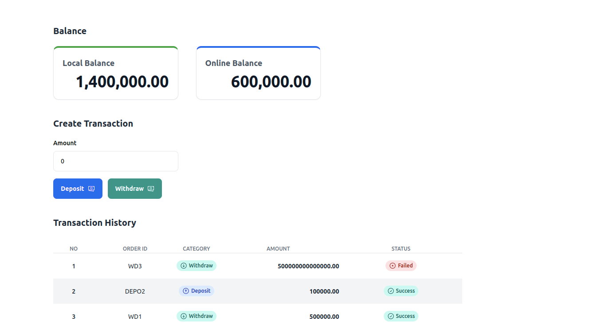

# Coding Collective Technical Test - Case Payment Service Build With Laravel




## Introduction
In this app you can deposit and withdraw from and to your local wallet and payment wallet.


## Tech stack
1. PHP 7.4
1. Laravel 7
1. Livewire 2
1. Mysql
1. Docker

## Usage

1. Git clone project
1. Make sure you have already install docker
1. run makefiles
    ``` 
    make install 
    ```
1. There is 2 application, Client App and Payment App. 
Run  makefiles seperated.

    Run Client App

    ``` 
    make run-client 
    ```
    Run Payment App
     ``` 
    make run-payment 
    ```
    Run Payment Queue
    ``` 
    make run-payment-queue
    ```


